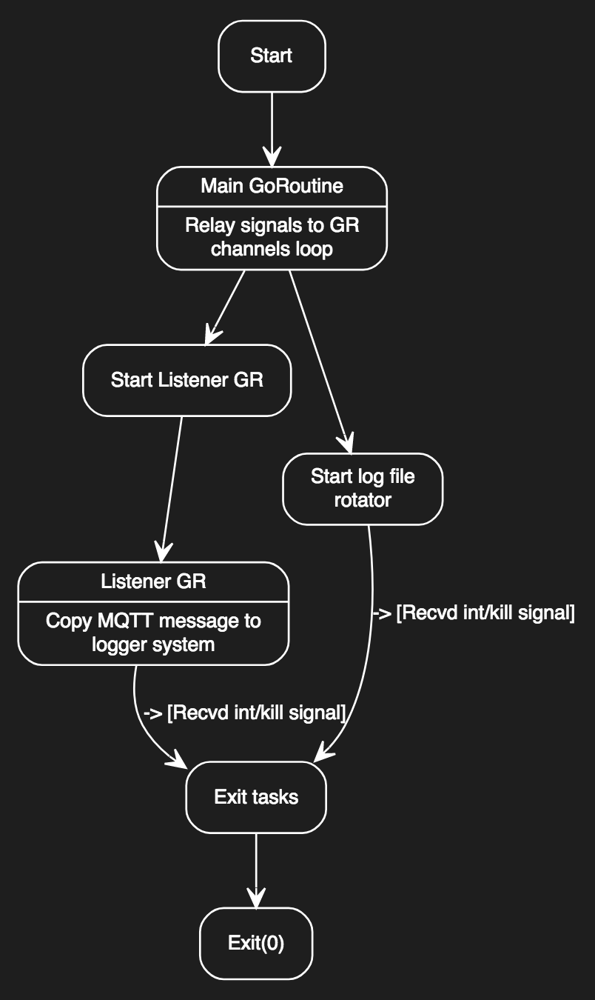

## MQTTBRIDGE

This application ties together the inbuilt MQTT broker on Junos to the internal event system (eventd). 

Here is the basic idea:

1.  `mqttbridge` connects to the MQTT broker on Junos via an IP address and port. You are required to configure an IP address of your choice, or 127.0.0.1 for the app to connect to MQTT.
2.  `mqttbridge` subscribes to a configurable topic like `junos/MQTTBridge` which happens to be the default. Once messages appear on this topic, this application copies them to eventd with the pattern: 
\<DATE HOST DAEMON: MSG_RECVD MESSAGE\>

Here is a real message: 
`May 22 16:14:00  vmx02 gojetmqttbridge[14019]: MSG_RECVD: Hello Junos from MQTT`

Note the number in the square bracket is the PID of the application.

## Oddities 

Somethings that the user needs to be aware of.

__Language__

This is written in Go in case you got here from Google and didn't realize.

__How do you daemonise in Go?__

Go doesn't daemonise in the traditional way

I've used a package which creates a child process and the parent exits, leaving the child running. This allows us to start as a service with a PID recorded in the PID file in `/var/db/jet`. Junos will complain that the application has already exited if you try and stop it using the Junos CLI. The classic Unix `kill` however works fine.

__Anything else?__

Not thus far.

## Design

The design is quite simple. I've done the most simple error checking and handling without unnecessarily complicating it. Go routines exit cleanly before main exits and errors are handled correctly. I would like to add at some point error message channels so each Go routine doesn't call log, but hey, it works well for now and there's nothing wrong with the current implementation. 

Here's the UML design I used as a reference.



## Building

We have to build this from source. Fear not, it's easy with Go! Here's the build instructions for Junos.

```bash
`git clone https://github.com/arsonistgopher/junos-jet-demo-apps.git`
# Change directory to junos-jet-demo-apps
cd mqtt_bridge
# Restore dependencies (requires godep tool)
godep restore
# Build the binary for Junos
GOOS=freebsd GOARCH=386 go build -o mqttbridge
```

The output file `mqttbridge` then needs to be packaged in to a JET package for Junos. You will require a signing certificate (from Juniper) and a tool-chain to build the application. I will be releasing soon a JET packaging application that consumes your binary and spits out the package, which unsurprisingly is also written in Go.

For more advanced users, I've included some tools like a test client for MQTT and a test client that opens a Unix Datagram socket for local machine based testing. This will allow you to take my code, modify it and test with local harnesses instead of directly on Junos. I use the MQTT broker on Junos instead of building my own because I'm lazy.

## The Junos Requirements

When it comes to installing this application and getting it running on Junos itself, here's what we need to do:

1.  Copy the JET package to Junos
```bash
scp mqttbridge-x86-32-0.1.tgz root@vmx:/var/tmp
```

2.  Install the package
```bash
root@vmx> request system software add /var/tmp/mqttbridge-x86-32-0.1.tgz
Verified mqttbridge-x86-32-0.1 signed by arsonistgopher method RSA2048+SHA1
```

3.  Configure the extension service and place arguments
```bash
set system extensions extension-service application file mqttbridge arguments "-topic junos/MQTTBridge -port 1883 -host 127.0.0.1"
```

4.  Test using an MQTT Client (also in this package)
```bash
./test_client -action pub -broker tcp://vmx:1883 -id 42 -message "Hello Junos from MQTT :)" -topic "junos/MQTTBridge"

# Show logs on Junos
root@vmx> show log messages | last
May 22 16:14:00  vmx gojetmqttbridge[14019]: MSG_RECVD: Hello Junos from MQTT :)
```

Any questions please feel free to get in touch. Other than that, happy hacking.


